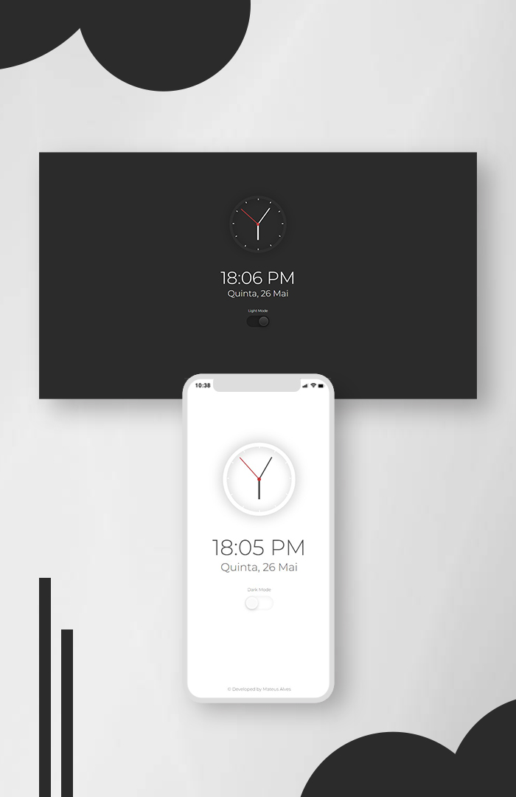

<h1>Relógio - Dark Mode</h1>

<h3>
  Projeto desenvolvido para estudos de javascript
</h3>
 

 <!-- <a href="#visao">• Visão geral</a>   -->
 <a href="#leng">• Skills utilizadas</a>
  
 <a href="#contato">• Contato</a>  

 

<h1>  Visão geral </h1>
Projeto "Relógio Analógico" + Data atual, com a opção de alternar o layout da página para <strong>Dark Mode</strong> ou <strong>Light Mode</strong>, com um botão super moderno. Desenvolvido com o objetivo de manipular data e hora, manipular a DOM e alternar estilos com o JavaScript. Também foi utilizado fontes externas importadas através do Google Fonts.

 
 

<h1 align="center">
<!-- <h1> -->
<a href="https://matealves.github.io/relogio_analogico/" target="_blank">Testar</a> 
</h1>

  

 

<h1>Skills utilizadas</h1>

 
  
  

 
 
 

 
 
 
